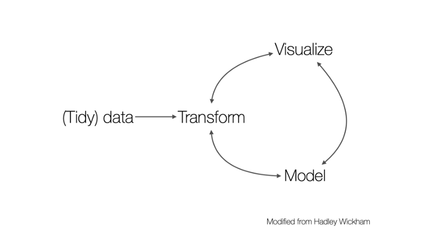
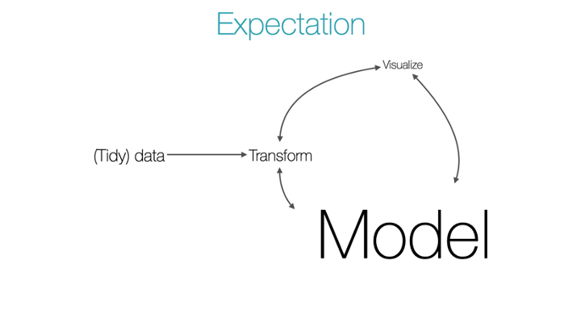
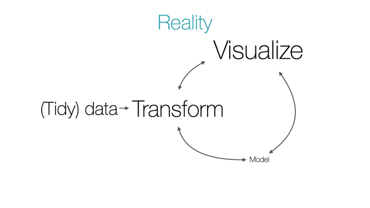
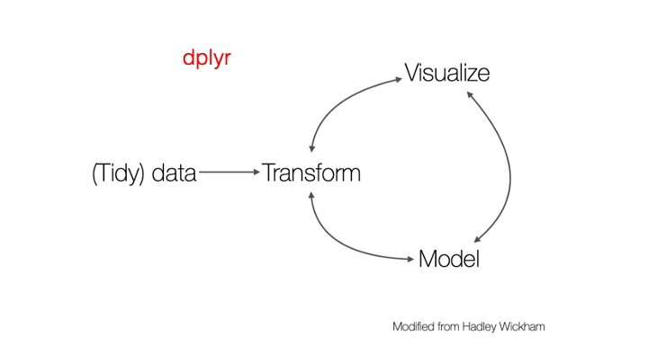
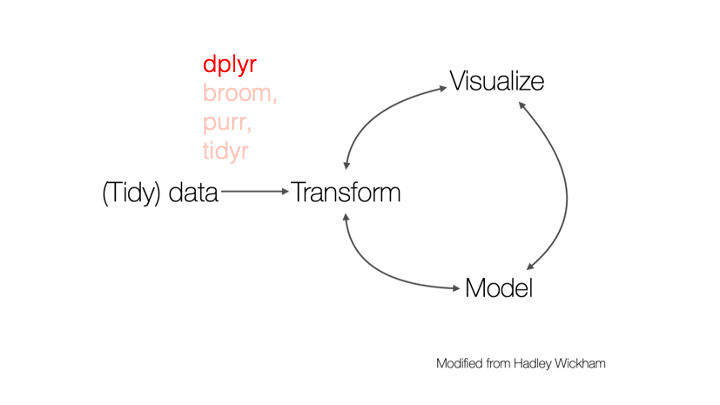
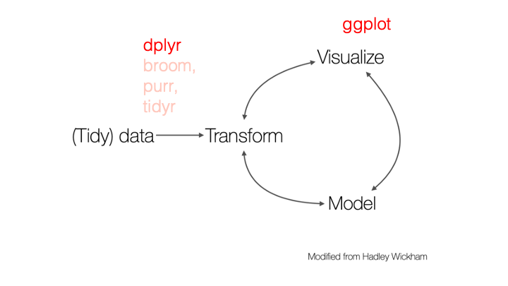
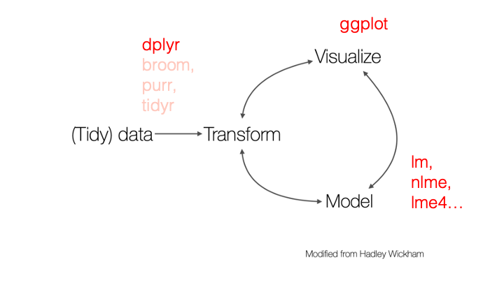

### Data wrangling is the first step in your workflow, after you import your data

---
```{r xaringanextra-tachyons, echo = FALSE}
xaringanExtra::use_tachyons()
```

### Data wrangling is the first step in your workflow, after you import your data

.center.bottom[
]

---
### Data wrangling is the first step in your workflow, after you import your data

.center.bottom[
]

---

### Data wrangling is the first step in your workflow, after you import your data

.center.bottom[
]

---

### Data wrangling is the first step in your workflow, after you import your data

.center.bottom[
]

---

### Data wrangling is the first step in your workflow, after you import your data

.center.bottom[
]
---

### Data wrangling is the first step in your workflow, after you import your data

.center.bottom[
]

---

### Data wrangling is the first step in your workflow, after you import your data

.center.bottom[
]
